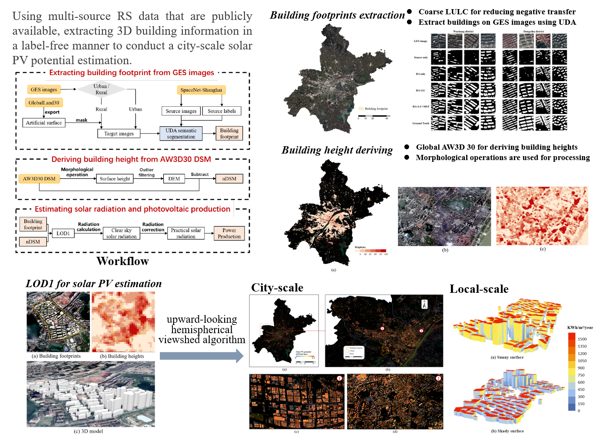

<h2> 
<a href="https://github.com/WHU-USI3DV/3DBIE-SolarPV/" target="_blank">City-scale solar PV potential estimation on 3D buildings using multi-source RS data: A case study in Wuhan, China</a>
</h2>

This is the PyTorch implementation about building information extraction of the following publication:

> **City-scale solar PV potential estimation on 3D buildings using multi-source RS data: A case study in Wuhan, China**<br/>
> [Zhe Chen](https://github.com/ChenZhe-Code), [Bisheng Yang](https://3s.whu.edu.cn/info/1025/1415.htm), [Rui Zhu](https://felix-rz.github.io/), [Zhen Dong](https://dongzhenwhu.github.io/index.html)<br/>
> [**Paper**](https://doi.org/10.1016/j.jag.2022.103107)  *Applied Energy Under Review*<br/>

The part on building extraction using unsupervised domain adapation utilized our another work:
> **Joint alignment of the distribution in input and feature space for cross-domain aerial image semantic segmentation**<br/>
> [Zhe Chen](https://github.com/ChenZhe-Code), [Bisheng Yang](https://3s.whu.edu.cn/info/1025/1415.htm), [Ailong Ma](http://jszy.whu.edu.cn/maailong/zh_CN/index.htm), Mingjun Peng, Haiting Li, Tao Chen, [Chi Chen](https://3s.whu.edu.cn/info/1025/1364.htm), [Zhen Dong](https://dongzhenwhu.github.io/index.html)<br/>
> [**Paper**](https://doi.org/10.1016/j.jag.2022.103107)  *JAG 2022*<br/>

## 🔭 Introduction
<p align="center">
<strong>City-scale solar PV potential estimation on 3D buildings using multi-source RS data:<br/> A case study in Wuhan, China</strong>
</p>
<div align=center>

</div>

<p align="justify">
<strong>Abstract:</strong>
Assessing the solar photovoltaic (PV) potential on buildings is essential for environmental protection and sustainable development. However, currently, the high costs of data acquisition and labor required to obtain 3D building models limit the scalability of such estimations extending to a large scale. To overcome the limitations, this study proposes a method of using freely available multi-source Remote Sensing (RS) data to estimate the solar PV potential on buildings at the city scale without any labeling. Firstly, Unsupervised Domain Adaptation (UDA) is introduced to transfer the building extraction knowledge learned by Deep Semantic Segmentation Networks (DSSN) from public datasets to available satellite images in a label-free manner. In addition, the coarse-grained land cover product is utilized to provide prior knowledge for reducing negative transfer. Secondly, the building heights are derived from the global open Digital Surface Model (DSM) using morphological operations. The building information obtained from the above two aspects supports the subsequent estimation. In the case study of Wuhan, China, the solar PV potential on all buildings throughout the city is estimated without any data acquisition cost or human labeling cost through the proposed method. In 2021, the estimated solar irradiation received by buildings in Wuhan is 289737.58 GWh. Taking into account the current technical conditions, the corresponding solar PV potential is 43460.64 GWh, which can meet the electricity demands of residents.
</p>

## 🆕 News
- 2023-12-15: Code is aviliable! 🎉


## 🚅 Cross-domain building footprint extraction
### 💻 Requirements
The code has been tested on:
- Ubuntu 20.04
- CUDA 11.3
- Python 3.8.0
- Pytorch 1.12.1
- GeForce RTX 3070 * 2.

### 🔧 Installation
You can create an environment directy using the provided ```environment.yaml```
```
cd UDA-Seg
conda env create -f environment.yaml
conda activate fgdal
```

### 💾 Dataset 
Our method has been experimented in both the benchmark and practical applications.
>- **ISPRS 2D cross-domain semantic segmentation benchmark**  
&ensp;&ensp;&ensp;&ensp;Provided by [Te Shi](https://github.com/te-shi/MUCSS?tab=readme-ov-file), the ISRPS image dataset for cross-domain semantic segmentation can be downloaded via [Google Drive](https://drive.google.com/file/d/1amV--tjtjBMUscUVBqXxXws_vBCo-QdV/view) or [BaiduDisk](https://pan.baidu.com/share/init?surl=Ob12TozQ2Xjcm3rcv7LuRA) (Acess Code: vaam).
>- **Pratical applications: SpaceNet-Shanghai to GES-Wuhan**  
&ensp;&ensp;&ensp;&ensp;The SpaceNet-Shanghai dataset and GES image dataset ( Wuchang District, Wuhan ) can be downloaded via [Google Drive](https://drive.google.com/drive/folders/1l5ARaev5hO95LG1e3e7top-Gda3y8BGb?usp=sharing) or [BaiduDist](https://pan.baidu.com/s/1qmGYUhlGQ9mJGvgez-bbwQ ) (Acess Code: 9527)

Once the datasets are downloaded and decompressed, change the folder path of the dataset according to the actual path in file *```UDA-Seg/core/datasets/dataset_path_catalog.py```* (line 33-36) for training and testing purposes.

### 🔦 Train
We provide the training script for source domain training and domain adaptation training. 
```
cd UDA-Seg
bash train_with_sd.sh
```
Specially, supervised training on labeled source domain data is needed to initialize the network parameters firstly.
```
# Set the num of GPUs, for example, 2 GPUs
export NGPUS=2
# train on source data
python -m torch.distributed.launch --nproc_per_node=$NGPUS train_src.py -cfg configs/configs/rs_deeplabv2_r101_src.yaml OUTPUT_DIR results/src_r101_try/
```
Then, we conduct the unlabeled target domain data and labeled source domain data for adversarial training to carry out domain adaptation.
```
# train with FGDAL-MSF-DNT
python -m torch.distributed.launch --nproc_per_node=$NGPUS train_SEmsf_dnt_adv_BD+FD_FreezeBackbone.py -cfg configs/rs_deeplabv2_r101_adv.yaml OUTPUT_DIR results/adv_test resume results/src_r101_try/model_iter030000.pth
```
Note that our framework does not use **self distill**. However, you can slightly modify the code (network) in *```train_self_distill.py```* to conduct self distill and further improve the performance.

```
# generate pseudo labels for self distillation
python test.py -cfg configs/rs_deeplabv2_r101_tgt_self_distill.yaml --saveres resume results/adv_test/model_iter080000.pth OUTPUT_DIR datasets/rs/soft_labels DATASETS.TEST rs_train
# train with self distillation
python -m torch.distributed.launch --nproc_per_node=$NGPUS train_self_distill.py -cfg configs/rs_r101_tgt_self_distill.yaml OUTPUT_DIR results/sd_test
```
### ✏️ Test

```
# Test the performance of a specific ckpt
python test_SEmsf_dnt.py -cfg configs/configs/rs_deeplabv2_r101_adv.yaml --saveres resume results/adv_test/model_iter080000.pth OUTPUT_DIR datasets/rs/pred
# Test the performance of all ckpt in a folder
python test_SEmsf_dnt.py -cfg configs/configs/rs_deeplabv2_r101_adv.yaml --saveres resume results/adv_test OUTPUT_DIR datasets/rs/pred
```
Additionaly, for predicting a RS image with large range, we provide a predition code based on sliding window.
```
python predcit_dnt_SEmsf_large_image.py -cfg configs/configs/rs_deeplabv2_r101_adv.yaml --img_path test_img/Wuchang_GES_Image.tif
```

## 🚅 Building height deriving from global DSM
### 💻 Requirements
The code has been tested on:
- Ubuntu 20.04
- Python 3.8.0

### 🔧 Installation
Fewer packages are required for building height extraction:
```
conda create -n BHD python==3.8
conda activate BHD
pip install matplotlib tqdm gdal argparse opencv-python
```

## 💾 Dataset 
The DSM with global coverage of 30m resolution is accessible in [Japan Aerospace Exploration Agency  Earth Observation Research Center](https://www.eorc.jaxa.jp/ALOS/en/aw3d30/data/index.htm).


## 🔦 Usage
To eval FreeReg on three benchmarks, you can use the following commands:
```
python BH_ExtractionFromAW3D30.py --input_path AW3D30_WH.tif --output_path BH_WH.tif
```

## 💡 Citation
If you find this repo helpful, please give us a 😍 star 😍.
Please consider citing our works if this program benefits your project.
```
@article{chen2022joint,
  title={Joint alignment of the distribution in input and feature space for cross-domain aerial image semantic segmentation},
  author={Chen, Zhe and Yang, Bisheng and Ma, Ailong and Peng, Mingjun and Li, Haiting and Chen, Tao and Chen, Chi and Dong, Zhen},
  journal={International Journal of Applied Earth Observation and Geoinformation},
  volume={115},
  pages={103107},
  year={2022},
  publisher={Elsevier}
}
```

## 🔗 Related Projects
We sincerely thank the excellent project:
- [FADA](https://github.com/JDAI-CV/FADA) for UDA semantic segmentation;